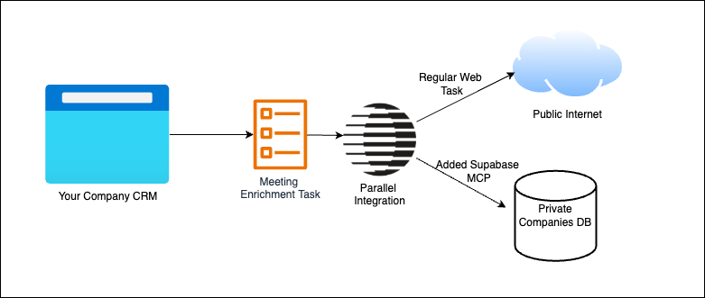

# Building a company enrichment agent using the Parallel Tasks API with MCP tools

[MCP is the most exciting thing in software right now](https://x.com/kentcdodds/status/1960740174566138335). Parallel Tasks allow [MCP tool calling](https://docs.parallel.ai/features/mcp-tool-call) as part of their Task API (now in Beta) which is very exciting! Besides the task using web data this allows you to use any private data. In this guide I'm going to show you how this works.

We'll explore how we could use a Database MCP to enrich your Company CRM with private data available in your datalake. [Discuss this usecase](https://x.com/janwilmake/status/1961056341444690052). We'll instruct to only use the web as a fallback in case the database doesn't have the info on the company.



First, let's see what the AI needs to know to build something with Tasks with MCP tools; appending `.md` to the docs pages give me the context I need in markdown format:

- https://docs.parallel.ai/features/mcp-tool-call.md
- https://docs.parallel.ai/task-api/core-concepts/specify-a-task.md
- https://docs.parallel.ai/api-reference/task-api-v1/create-task-run.md
- https://docs.parallel.ai/api-reference/task-api-v1/retrieve-task-run-result.md

Let's [ask the AI](https://letmeprompt.com/rules-httpsuithu-k0w66o0) to make a nice curl to see if this works. For now I'll use a simple public MCP: https://docs.devin.ai/work-with-devin/deepwiki-mcp.md (url: https://mcp.deepwiki.com/mcp). My key learning here is that you cannot ask the task about the tools itself, so I slightly altered the task to use one of the actual tools, which worked brilliantly!

```sh
API_KEY="YOUR_KEY" && \
RUN_ID=$(curl -s -X POST "https://api.parallel.ai/v1/tasks/runs" \
  -H "x-api-key: $API_KEY" \
  -H "Content-Type: application/json" \
  -H "parallel-beta: mcp-server-2025-07-17" \
  --data '{
    "input": "What is the purpose of janwilmake/dorm and how to use it?",
    "processor": "lite",
    "mcp_servers": [
      {
        "type": "url",
        "url": "https://mcp.deepwiki.com/mcp",
        "name": "deepwiki_mcp"
      }
    ]
  }' | tee /dev/stderr | jq -r '.run_id') && \
echo "Run ID: $RUN_ID" && \
curl -s "https://api.parallel.ai/v1/tasks/runs/$RUN_ID/result" \
  -H "x-api-key: $API_KEY" | tee /dev/stderr | jq '.'
```

Result:

```json
{
  "run": {
    "run_id": "trun_36d27f69cc5d41b4bfbf17f12a642cc6",
    "status": "completed",
    "is_active": false,
    "warnings": null,
    "error": null,
    "processor": "lite",
    "metadata": {},
    "taskgroup_id": null,
    "created_at": "2025-08-26T10:47:05.317955Z",
    "modified_at": "2025-08-26T10:47:27.821851Z"
  },
  "output": {
    "basis": [
      {
        "field": "output",
        "citations": [],
        "reasoning": "The response is based on the information from the deepwiki_mcp tool call, which provided a detailed explanation of the janwilmake/dorm repository's purpose and usage.",
        "confidence": ""
      }
    ],
    "mcp_tool_calls": [
      // 2 tool calls
    ],
    "type": "json",
    "content": {
      "output": "The `janwilmake/dorm` repository offers DORM (Durable Object Relational Mapping), a system that simplifies interactions with SQLite databases within Cloudflare Durable Objects. It abstracts the complexities of managing Durable Objects, providing a developer-friendly interface for SQL operations on distributed SQLite databases. To use DORM, you typically interact with the `createClient` function. First, install DORM using npm: `npm i dormroom`. Then, initialize a DORM client by calling `createClient`, passing your `DurableObjectNamespace`, a `DBConfig` object, and optional `doConfig`. Once the client is initialized, you can perform various database operations like raw SQL queries or ORM operations."
    },
    "output_schema": {}
  }
}
```

Learnings:

- You can not ask it about the available tools
- Unlike the docs suggest, even with lite, it's possible that the task performs more than one tool call
- It can take quite a while even with 'lite' to get a response because the MCP tool calls can also consume some time. In this case, it took 22 seconds for a response.

# Using The Authorized Pitchbook MCP

Great! Now, let's see if we can also use MCP servers that require authorization. This should be possible by passing authorization header to the MCP tool.

I found [this Pitchbook MCP Server](https://apify.com/pratikdani/pitchbook-companies-scraper/api/mcp) which costs $19/month + more for usage, but has 2 hours free.

The MCP URL is: https://mcp.apify.com/?actors=pratikdani/pitchbook-companies-scraper and it requires a Authorization bearer token. After trying it i found that there were some other tools that were called that didn't give the right result. So I inspected it with https://mcp.p0web.com and found that the only useful tool in the MCP is `pratikdani-slash-pitchbook-companies-scraper`. After using it, I saw that it used the tool but with the wrong argument, because it didn't know what to input.

```json
"arguments": "{\"url\": \"https://pitchbook.com/profiles/company/10874-98\"}",
```

This is likely the example company URL. The company url of parallel (https://pitchbook.com/profiles/company/697228-84) was not part of the search results, so let's add a source policy to only get results from pitchbook:

```sh
API_KEY="PARALLEL_KEY" && \
RUN_ID=$(curl -s -X POST "https://api.parallel.ai/v1/tasks/runs" \
  -H "x-api-key: $API_KEY" \
  -H "Content-Type: application/json" \
  -H "parallel-beta: mcp-server-2025-07-17" \
  --data '{
    "input": "What can you look up about the company parallel web systems? what funding did they raise?",
    "processor": "base",
     "source_policy": {
        "include_domains": ["pitchbook.com"]
    },
    "mcp_servers": [
      {
        "type": "url",
        "url": "https://mcp.apify.com/?actors=pratikdani/pitchbook-companies-scraper",
        "name": "pitchbook_mcp",
        "allowed_tools":["pratikdani-slash-pitchbook-companies-scraper"],
        "headers": { "Authorization": "Bearer APIFY_KEY"}
      }
    ]
  }' | tee /dev/stderr | jq -r '.run_id') && \
echo "Run ID: $RUN_ID" && \
curl -s "https://api.parallel.ai/v1/tasks/runs/$RUN_ID/result" \
  -H "x-api-key: $API_KEY" | tee /dev/stderr | jq '.'
```

This worked! It successfully first found the right URL using web search, then filled it in using the MCP tool!

```json
{
  "tool_call_id": "toolu_01H9FqZJpw1Z563QEHZ2MeyK",
  "server_name": "",
  "tool_name": "pratikdani-slash-pitchbook-companies-scraper_shap_sep_pitchbook_mcp",
  "arguments": "{\"url\": \"https://pitchbook.com/profiles/company/697228-84\"}",
  "content": "",
  "error": "Tool call timed out after 30.0 seconds."
}
```

Unfortunately, this MCP is too slow for parallel, and the tool-call timed out after 30 seconds. After trying 2 more times, I got a result within 10 seconds (probably due to a cold-start not being needed in Apify). Amazing! Now it succesfully based its answer on the MCP toolcall:

```json
{
  "run": {
    "run_id": "trun_36d27f69cc5d41b48ac24e7adee81259",
    "status": "completed",
    "is_active": false,
    "warnings": null,
    "error": null,
    "processor": "base",
    "metadata": {},
    "taskgroup_id": null,
    "created_at": "2025-08-26T12:00:45.597654Z",
    "modified_at": "2025-08-26T12:01:29.420969Z"
  },
  "output": {
    "basis": [
      {
        "field": "output",
        "citations": [
          {
            "title": null,
            "url": "https://pitchbook.com/profiles/company/697228-84",
            "excerpts": []
          }
        ],
        "reasoning": "The answer was constructed using information found on the PitchBook profile for Parallel (parallel-web). The company description, headquarters, funding, investors, and employee count were all sourced from this profile. Disambiguation was performed to ensure the correct 'Parallel' company was identified, avoiding similarly named entities.",
        "confidence": ""
      }
    ],
    "mcp_tool_calls": [
      {
        "tool_call_id": "toolu_01DfCeecjHbpPKwrzzciDFWP",
        "server_name": "pitchbook_mcp",
        "tool_name": "pratikdani-slash-pitchbook-companies-scraper",
        "arguments": "{\"url\": \"https://pitchbook.com/profiles/company/697228-84\"}",
        "content": "Actor finished with runId: vsPkqokg3qOwomCSi, datasetId nOxyCatu8MN73aGDb\n{\"url\":\"https://pitchbook.com/profiles/company/697228-84\",\"id\":\"697228-84\",\"company_name\":\"Parallel (California)\",\"company_socials\":[{\"domain\":\"twitter.com\",\"link\":\"https://twitter.com/p0\"},{\"domain\":\"www.linkedin.com\",\"link\":\"https://www.linkedin.com/company/parallel-web\"}],\"year_founded\":2023,\"status\":\"Private\",\"employees\":27,\"latest_deal_type\":\"Early Stage VC\",\"financing_rounds\":null,\"investments\":null,\"description\":\"Developer of a web API designed to power accurate and verifiable research for AI agents. The company offers cross-referenced factual outputs, flexible compute pricing, and structured data extraction, enabling AI developers and enterprises to run deep, multi-hop research workflows with minimal hallucination.\",\"contact_information\":[{\"Type\":\"Website\",\"value\":\"www.parallel.ai\"},{\"Type\":\"Ownership Status\",\"value\":\"Privately Held (backing)\"},{\"Type\":\"Financing Status\",\"value\":\"Venture Capital-Backed\"},{\"Type\":\"Corporate Office\",\"value\":\"2261 Market Street, Suite 5578, San Francisco, CA 94114, United States\"},{\"Type\":\"Primary Industry\",\"value\":\"Business/Productivity Software\"},{\"Type\":\"Vertical(s)\",\"value\":\"SaaS, Artificial Intelligence & Machine Learning\"},{\"Type\":\"Corporate Office\",\"value\":\"2261 Market Street, Suite 5578, San Francisco, CA 94114, United States\"}],\"competitors\":[{\"company_name\":\"Aura Software\",\"financing_status\":\"Corporate Backed or Acquired\",\"link\":\"https://pitchbook.com/profiles/company/512218-63\",\"location\":\"Ede, Netherlands\"},{\"company_name\":\"Immutable X\",\"financing_status\":\"Venture Capital-Backed\",\"link\":\"https://pitchbook.com/profiles/company/230704-12\",\"location\":\"Sydney, Australia\"}],\"all_investments\":null,\"faq\":[{\"type\":\"Question\",\"value\":\"When was Parallel (California) founded?\"},{\"type\":\"Answer\",\"value\":\"Parallel (California) was founded in 2023.\"},{\"type\":\"Question\",\"value\":\"Where is Parallel (California) headquartered?\"},{\"type\":\"Answer\",\"value\":\"Parallel (California) is headquartered in San Francisco, CA.\"},{\"type\":\"Question\",\"value\":\"What is the size of Parallel (California)?\"},{\"type\":\"Answer\",\"value\":\"Parallel (California) has 27 total employees.\"},{\"type\":\"Question\",\"value\":\"What industry is Parallel (California) in?\"},{\"type\":\"Answer\",\"value\":\"Parallel (California)’s primary industry is Business/Productivity Software.\"},{\"type\":\"Question\",\"value\":\"Is Parallel (California) a private or public company?\"},{\"type\":\"Answer\",\"value\":\"Parallel (California) is a Private company.\"},{\"type\":\"Question\",\"value\":\"What is Parallel (California)’s current revenue?\"},{\"type\":\"Answer\",\"value\":\"The current revenue for Parallel (California) is <i></i><i></i><i></i><i></i>.\"},{\"type\":\"Question\",\"value\":\"How much funding has Parallel (California) raised over time?\"},{\"type\":\"Answer\",\"value\":\"Parallel (California) has raised $30M.\"},{\"type\":\"Question\",\"value\":\"Who are Parallel (California)’s investors?\"},{\"type\":\"Answer\",\"value\":\"<a href=\\\"https://pitchbook.com/profiles/investor/616261-96\\\" target=\\\"_blank\\\" class=\\\"font-underline\\\">Terrain</a>, <a href=\\\"https://pitchbook.com/profiles/investor/11189-44\\\" target=\\\"_blank\\\" class=\\\"font-underline\\\">First Round Capital</a>, <a href=\\\"https://pitchbook.com/profiles/investor/11216-98\\\" target=\\\"_blank\\\" class=\\\"font-underline\\\">Index Ventures</a>, and <a href=\\\"https://pitchbook.com/profiles/investor/11227-60\\\" target=\\\"_blank\\\" class=\\\"font-underline\\\">Khosla Ventures</a> have invested in Parallel (California).\"},{\"type\":\"Question\",\"value\":\"Who are Parallel (California)’s competitors?\"},{\"type\":\"Answer\",\"value\":\"<a href=\\\"https://pitchbook.com/profiles/company/512218-63\\\" target=\\\"_blank\\\" class=\\\"font-underline\\\">Aura Software</a> and <a href=\\\"https://pitchbook.com/profiles/company/230704-12\\\" target=\\\"_blank\\\" class=\\\"font-underline\\\">Immutable X</a> are competitors of Parallel (California).\"}]}",
        "error": ""
      }
    ],
    "type": "json",
    "content": {
      "output": "Company: Parallel (often referenced as Parallel / parallel-web) — San Francisco-based developer of a web API to enable AI agents to research and compute over web data; product focuses on cross-referenced factual outputs, structured data extraction, and flexible compute for multi‑hop research workflows. Headquarters: 2261 Market Street, Suite 5578, San Francisco, CA 94114. Status & size: Private, ~27 employees (per the latest scrape). Funding: Raised $30M total. Known investors: Terrain, First Round Capital, Index Ventures, and Khosla Ventures. Note: PitchBook profile snapshots show small discrepancies in founding year (2023 vs. 2024) and headcount across versions; the funding total and investor names above are consistent in the available records."
    },
    "output_schema": {}
  }
}
```

It'd be great if [Pitchbook](https://pitchbook.com) had their own remote MCP instead of relying on a paid MCP on [Apify](https://apify.com) since this makes it a lot slower, unfortuantely making this slightly unusable together with Parallel.ai. Maybe I can make my own Pitchbook Remote MCP based on some of their APIs in another guide! But for now, let's continue with this, and assume this problem will be solved later.

To summarize, some learings:

- You should know well what the MCP tools there are and what they require as input before you define your prompt! You need to ensure the web results or input prompt include that information, or the MCP might be used in the wrong way. Parallel Agent doesn't seem to hesitate to use it with obviously incorrect input, or even use a unrelated tool. This may also be due to bad MCP quality.
- Source policy is useful if the MCP input require URLs
- MCP tool calls time out after 30s, so ensure your used MCP is fast enough.
- I also tried the same curl with the "core" processor, but this consistently gave me the following error (lite and base processors worked fine):

```
{
  "type": "error",
  "error": {
    "ref_id": "90fc8bb7-5ff8-4b83-b33c-13aaedbd9e83",
    "message": "Run failed.",
    "detail": null
  }
}
```

# Choosing a Database MCP

Since

After [researching MCPs](https://x.com/janwilmake/status/1960649274569457805), I found [Supabase MCP on Smithery](https://smithery.ai/server/@supabase-community/supabase-mcp) which allows read-only or read+write connections to any Supabase Postgres Database. [They're still on the stdio transport](https://github.com/supabase-community/supabase-mcp/issues/123) which is a bit risky for the sake of the demo. I also found [The Disco.dev Supabase Server](https://disco.dev/integrations/supabase) which seems more risk-free. After trying both as [claude.ai connectors](https://claude.ai/settings/connectors), I found the smithery.ai MCP to be more user-friendly, since it allowed access to the right project immediately by specifying a project ID in the oauth flow. Also, the Smithery MCP didn't require me to pass an additional API key for doing queries in a database, while the Disco.dev one did.

It was very straightforward to seed the database with some dummy data. All I needed to do is ask that in natural language:

Some things I asked:

```
test each tool in the mcp
```

```
can you seed some dummy data into this project? it should be a companies table with some fake details. im using this for a demo
```

```
please use supabase mcp to add some additional niche information columns to the companies db and come up with some dummy data for the existing companies
```

```
hey, can you see which tables there are and how many rows ?
```

[Result of that last one here](https://claude.ai/share/bcb37c6d-d466-470e-b419-68d7bbd49de6)

# How the architecture will work

We'll build the following frontend:

1. Collect User Data into Frontend Local Storage:

- User should fill in their Parallel API key (obtainable at )
- User should fill in their MCP access token (Since the Smithery MCP requires OAuth, obtainable by visiting https://mcp.p0web.com and performing the OAuth flow using the Smithery URL of the Supabase MCP: `https://server.smithery.ai/@supabase-community/supabase-mcp/mcp`)

2. Select one of dummy company names to perform enrichment task

3. Optionally edit the task template which contains `{{name}}` before submitting the task

4. See results of the task stream back, nicely rendered with confidence and reasoning; also see which MCPs were used.

On the back-end, we'll just need an endpoint `/task?input=string&parallelApiKey=string&mcpAccessToken=string => ReadableStream | Error`

# Using the Typescript SDK to bring it together

Now let's use the Typescript SDK for this. To make it easier to use the SDK with LLMs I created [this context of the entire SDK public API](https://rules-httpsuithu-s10son0.letmeprompt.com/parallel-sdk.d.ts), which totals around 4.5k tokens.

Now the context doesn't required doesn't include the OpenAPI specs anymore, but instead, the typescript SDK. There's currently no easy way to get a subset of the SDK surface area (for reducing context window), but this may be added to the SDK in the future.

Besides this, let's use streaming events to see intermediate updates. We can use this to nicely render a UI for the end-user.

Here's what we can use to run a task over the SDK:

- https://docs.parallel.ai/features/mcp-tool-call.md
- https://docs.parallel.ai/task-api/core-concepts/specify-a-task.md
- https://rules-httpsuithu-s10son0.letmeprompt.com/parallel-sdk.d.ts
- https://docs.parallel.ai/task-api/features/task-sse.md

# How to integrate?

Go into the authorization problem a bit and refer to future guides.

# TODO

- https://mcp.p0web.com should make the access tokens for each MCP easily copyable.
- Hold context against spec, building out simple solution.
